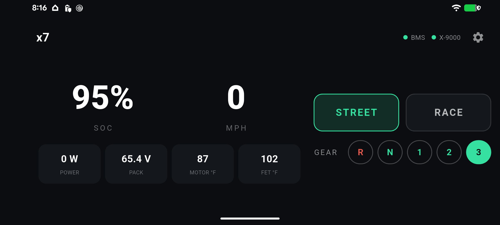

# x7 — open dashboard & control center for Talaria (Greenway BMS + EBMX X-9000)

**x7** is an open-source **Flutter** app that turns a phone into a live dashboard and control
center for a Talaria-class ebike, by talking **over Bluetooth** to two devices at once:

- the **Greenway BMS** (state of charge, cell voltages, temperatures, current), and
- the **EBMX X-9000** motor controller (speed, power, temps, ride mode, and control).

It's a **repeatable, wire-free, fully reversible mod**: install the app, connect, ride. The baseline
app changes **nothing** on the bike — it only reads and uses features that are already reachable
over Bluetooth. (Ride-mode control is an optional advanced feature; see below.)

> Early stage / work in progress. The protocol layers are ported from working reference
> implementations; the UI is a starting point meant to grow with contributions. See
> [CONTRIBUTING.md](CONTRIBUTING.md).

*Live dashboard: merged BMS + controller telemetry, Street/Race mode, and the gear selector (R/N/1/2/3). Shown connected to an X-9000 V3.*

## Download

Prebuilt APKs are on the **[Releases page](https://github.com/svyourmom/x7/releases)** — one
universal APK per release (`arm64-v8a` + `armeabi-v7a` + `x86_64`), so a single file installs on
essentially any Android phone. Builds are produced by GitHub Actions straight from the tagged
source; per-commit builds are also kept as artifacts on the
[Actions runs](https://github.com/svyourmom/x7/actions/workflows/build.yml) (GitHub sign-in
required to download those).

- Android will ask you to allow installing from unknown sources, and may warn that the developer
  is unrecognised — these builds are signed with the CI runner's throwaway debug key, not a
  registered developer certificate.
- **Upgrading requires uninstalling first.** That key differs from build to build, and Android only
  allows an in-place update when the signature matches. Remove the old x7 (Settings → Apps → x7 →
  Uninstall, or `adb uninstall com.svyourmom.x7`) before installing a newer one. This resets the
  app's saved settings.

Read [Safety](#safety) before connecting to a bike.

## Companion references

x7 is built on two open protocol references — read these to understand what the app is talking to:

- **[svyourmom/x7-vesc](https://github.com/svyourmom/x7-vesc)** — EBMX X-9000 BLE / CAN / firmware
  reverse-engineering reference (the controller side).
- **[svyourmom/Talaria-Greenway-BMS-Protocol-Reference](https://github.com/svyourmom/Talaria-Greenway-BMS-Protocol-Reference)**
  — the battery/BMS side.

## What it does — in tiers

Control unlocks in tiers; the dashboard **reads** everything (telemetry, ride mode, gear) at every
tier. Full setup detail: **[docs/setup-hardware-software.md](docs/setup-hardware-software.md)**.

- **Tier 1 — stock bike, no changes:** live merged BMS + controller telemetry, live mode + gear
  read-out, and the terminal-exposed tuning (traction control, wheel-lift limiter). Control buttons
  are inert (the controller takes mode/gear only as CAN frames from the display).
- **Tier 2 — CAN-RX injector firmware** (small, reversible, documented in **x7-vesc**): ride
  **mode** becomes fully controllable and sticks; gear can be sent but a connected display
  overwrites it.
- **Tier 3 — injector firmware + SW102T display disconnected:** x7 becomes the sole source of the
  gear frames, so **gear control holds** and the phone replaces the display entirely
  (**app-as-cockpit**). The display reconnects any time as a hardwired backup — see the setup doc.

The injector firmware is inert unless x7 sends it a frame, and the display/no-display states switch
with a connector (no re-flash), so nothing here is a one-way door.

## Tech

- **Flutter** (Android first; iOS later from the same codebase).
- BLE via `flutter_blue_plus` — **two simultaneous connections** (BMS + controller).
- VESC packet protocol (framing + CRC-16/XMODEM), ported from the reference tools.

## Status & roadmap

Working dashboard: dual-BLE (BMS + controller) telemetry, ride-mode control, and gear control
(with the injector firmware; see [setup](docs/setup-hardware-software.md)). Verified on an
X-9000 V3.

**Status of features**
- **Speed (MPH / KM-H): early success, not thoroughly tested.** Now reads the controller's own
  firmware-computed road speed (from `GET_VALUES_SETUP`), not a stub — it looked correct in initial
  on-bike testing. Still needs a proper GPS/known-speed check across the range before it's trusted.
- Everything else on the dashboard (telemetry, mode, gear) is confirmed against the bike.
- Portrait layout works but is unofficial; landscape is the intended handlebar orientation.

Not affiliated with EBMX, VESC, Greenway, Talaria, or Stark.

## License

- **Code:** GPLv3 (see [LICENSE](LICENSE)) — aligns with VESC and keeps the mod ecosystem open.
- **Docs** (`docs/`): CC BY 4.0.

## Safety

Interacting with a motor controller can be dangerous and can damage hardware. Use at your own risk,
on hardware you own, wheel off the ground when testing. This project is provided **as-is, without
warranty**.
